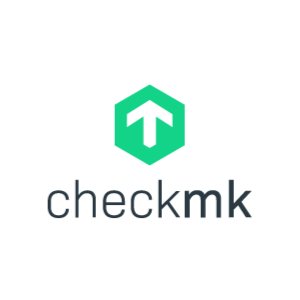
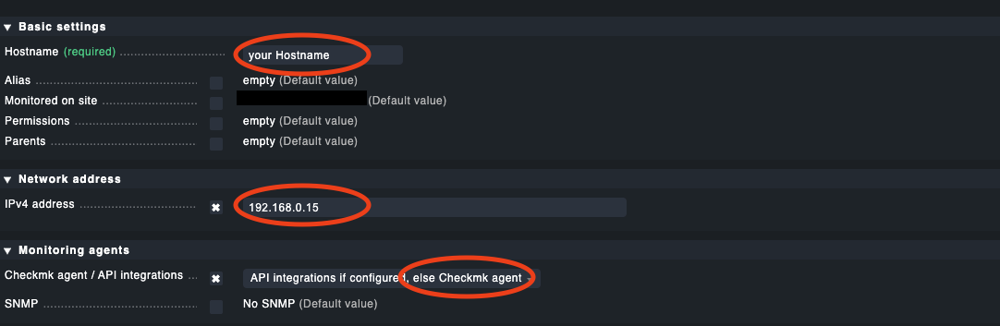
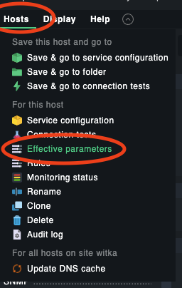
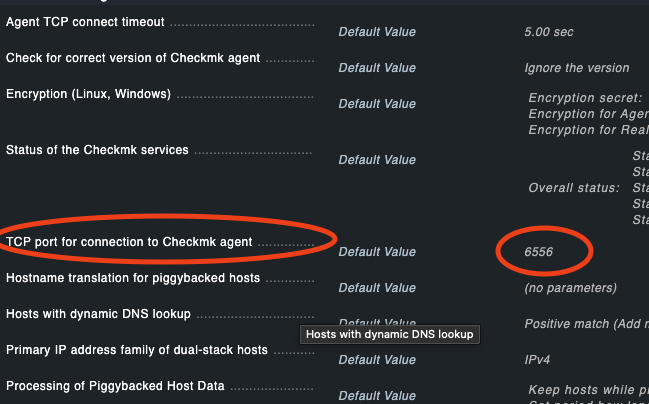
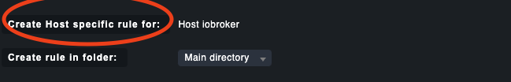
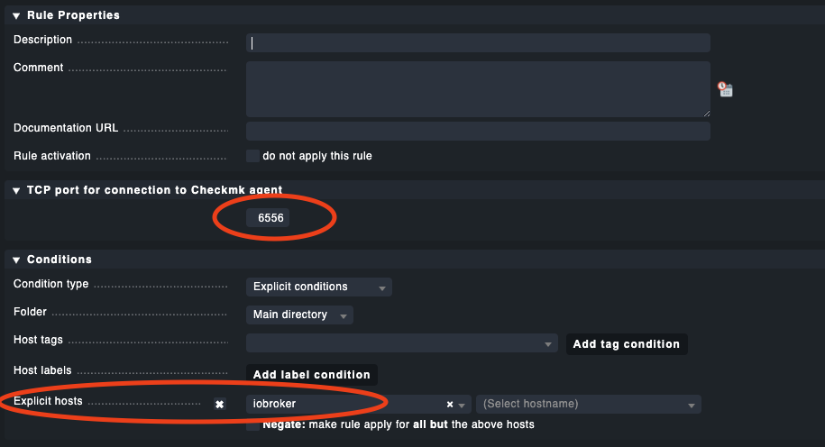

# ioBroker.checkmk

**Tests:** 

## checkmk for ioBroker

Adapter to send information from the ioBroker to Check MK.

Important:
This adapter creates its own Check MK agent.
That means it runs independently of the "normal" agent which e.g. requests the system data.

This adapter only delivers data from the ioBroker. System data are not queried.
(But you can add your own states from the iOBroker, so that there are no limits here)

---

Adapter um Informationen aus dem ioBroker an Check MK zu senden.

Wichtig:
Dieser Adapter erstellt einen eigenen Check MK Agenten.
Das bedeutet er läuft unabhänig vom "normalen" Agenten welcher z.B. die Systemdaten abfrägt.

Dieser Adapter liefer nur daten aus dem ioBroker. Systemdaten werden nicht abgefragt.
(Man kann aber eigene States aus dem iOBroker hinzufügen, sodass hier keine Grenzen gesetzt sind)

## Add information to check mk.
If you already use a Check mk agent on the server, you have to create your own new host for the ioBroker.
1. add a new host:

It is important to select that it is an agent here

If there is no other agent installed on the system, the setup is done.

If there is already an agent on the system, the standard port for the agent must be changed for the new host.

2. change the standard port:

---
Wenn du bereits einen Check mk Agenten auf dem Server nutzt so musst du einen eigenen neuen Host für den ioBroker anlegen.
1. neuen Host Hinzufügen:

Es ist hier wichtig, dass der Agent ausgewählt wird.

Wenn sonst kein weiterer Agent auf dem System installiert ist, dann ist die Einrichtugn schon fertig.

Ist bereits ein Agent auf dem System so muss für den neuen Host noch der Standard Port für den Agenten geändert werden.

## Functions:
The adapter currently has the following options:
- Monitors the status of the installed adapters (can be switched on or off via the settings)
- Monitors whether updates are available
- Your own data points can also be added.
This can be done in the respective settings of the data point

--- 

Aktuell hat der Adapter folgende Optionen:
- Überwacht den Status der installierten Adapter (Kann über die Einstellungen ein bzw. ausgeschaltet werden)
- Überwacht ob Updates vorhanden sind
- Eigene Datenpunkte können ebenfalls hinzugefügt werden.
Dies geht in den jeweiligen Einstellungen des Datenpunktes

## Changelog

* (rde-master) initial release

### **WORK IN PROGRESS**
* (rde-master) initial release

## License
MIT License

Copyright (c) 2021 rde-master <info@rde-master.de>

Permission is hereby granted, free of charge, to any person obtaining a copy
of this software and associated documentation files (the "Software"), to deal
in the Software without restriction, including without limitation the rights
to use, copy, modify, merge, publish, distribute, sublicense, and/or sell
copies of the Software, and to permit persons to whom the Software is
furnished to do so, subject to the following conditions:

The above copyright notice and this permission notice shall be included in all
copies or substantial portions of the Software.

THE SOFTWARE IS PROVIDED "AS IS", WITHOUT WARRANTY OF ANY KIND, EXPRESS OR
IMPLIED, INCLUDING BUT NOT LIMITED TO THE WARRANTIES OF MERCHANTABILITY,
FITNESS FOR A PARTICULAR PURPOSE AND NONINFRINGEMENT. IN NO EVENT SHALL THE
AUTHORS OR COPYRIGHT HOLDERS BE LIABLE FOR ANY CLAIM, DAMAGES OR OTHER
LIABILITY, WHETHER IN AN ACTION OF CONTRACT, TORT OR OTHERWISE, ARISING FROM,
OUT OF OR IN CONNECTION WITH THE SOFTWARE OR THE USE OR OTHER DEALINGS IN THE
SOFTWARE.